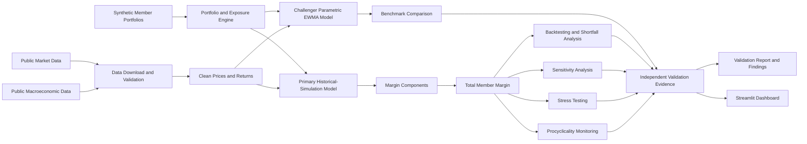

# CCP Margin Model Independent Validation Framework

[](https://www.python.org/)
[](#test-commands)
[](#dashboard-screenshot)
[](#project-disclaimer)

## Executive Description

This repository implements an end-to-end, reproducible framework for independently developing, challenging, and validating a central counterparty clearing margin model. The project covers synthetic clearing-member portfolios, public market data, primary and challenger margin methodologies, margin add-ons, backtesting, benchmark comparison, sensitivity analysis, stress testing, procyclicality assessment, implementation verification, validation findings, evidence generation, and an executive Streamlit dashboard.

The framework is designed as a model-risk-management portfolio project. It demonstrates how a validator can separate model development from independent review, translate conceptual requirements into testable controls, preserve reproducible evidence, and communicate conclusions, limitations, and remediation priorities.

## Business and Regulatory Motivation

Central counterparties manage counterparty exposure by collecting margin from clearing members. A margin framework must remain sufficiently risk-sensitive to cover potential liquidation losses while avoiding unexplained instability, excessive procyclicality, weak implementation controls, or dependence on a single methodology.

This project applies independent-validation principles commonly used in financial model-risk management:

- clear model purpose, scope, assumptions, and limitations;
- documented primary and challenger methodologies;
- data-quality and implementation controls;
- outcome analysis through backtesting and margin-shortfall testing;
- parameter sensitivity and benchmark comparison;
- historical, hypothetical, and reverse stress testing;
- procyclicality measurement and stability analysis;
- traceable findings, severity classification, and remediation evidence.

The implementation is not a regulatory approval, legal opinion, or representation of any clearing agency's proprietary methodology.

## Project Disclaimer

This repository is an independent educational and portfolio implementation
using public and synthetic data. It is not an implementation of any
proprietary DTCC, NSCC, FICC, OCC, CME, ICE, or other clearing-agency model.
It is not intended for production margining, regulatory compliance, trading,
investment, or risk-management decisions.

## Architecture Diagram



## Model Inventory

| Component | Role | Core Methodology | Implementation Status |
|---|---|---|---|
| Primary margin model | Primary risk measure | 99% historical-simulation Value at Risk with configurable lookback and margin period of risk | Implemented |
| Challenger margin model | Independent benchmark | Parametric variance-covariance VaR with EWMA covariance and correlation controls | Implemented |
| Multi-day risk | Liquidation-horizon scaling | Direct multi-day returns and square-root-of-time comparison | Implemented within primary and challenger workflows |
| Liquidity add-on | Market-liquidity risk | Position size relative to trading-volume or liquidity thresholds | Implemented |
| Concentration add-on | Name and portfolio concentration | Exposure concentration relative to configured thresholds | Implemented |
| Gap-risk add-on | Discontinuous price-move risk | Scenario-based or position-specific gap charge | Implemented |
| Stress buffer | Tail and regime risk | Configurable stressed-loss buffer | Implemented |
| Total margin | Aggregate requirement | Base margin plus applicable add-ons and buffers | Implemented |
| Validation framework | Independent challenge | Coverage tests, independence tests, benchmark comparison, sensitivity, stress, shortfall, implementation verification, and procyclicality | Implemented |

## Margin Formula

For member \(m\) on date \(t\), the conceptual total initial-margin requirement is:

\[
IM_{m,t}
=
\max\left(
BM_{m,t},
SM_{m,t}
\right)
+
LA_{m,t}
+
CA_{m,t}
+
GA_{m,t}
+
SB_{m,t},
\]

where:

- \(BM\) is base margin from the primary VaR model;
- \(SM\) is any applicable stressed or benchmark floor;
- \(LA\) is the liquidity add-on;
- \(CA\) is the concentration add-on;
- \(GA\) is the gap-risk add-on;
- \(SB\) is the stress buffer.

The exact aggregation logic is configuration-driven and should be interpreted together with the model documentation, assumptions, and limitations.

## Validation Framework

The independent-validation framework includes:

| Validation Area | Principal Tests and Evidence |
|---|---|
| Conceptual soundness | Methodology review, assumptions, risk coverage, model inventory, and benchmark rationale |
| Data quality | Completeness, duplicates, missing observations, date continuity, schema checks, and exception evidence |
| Outcome analysis | Backtesting exceptions, margin shortfalls, realized-loss coverage, and member-level diagnostics |
| Statistical backtesting | Kupiec unconditional coverage; Christoffersen independence and conditional coverage |
| Traffic-light assessment | Basel-style exception classification |
| Benchmarking | Primary historical-simulation model versus parametric EWMA challenger |
| Sensitivity and stability | Confidence level, lookback, MPOR, EWMA decay, add-on thresholds, stress buffers, and correlation shocks |
| Stress testing | Historical, hypothetical, concentration, liquidity, wrong-way, and reverse-stress scenarios |
| Procyclicality | Daily and weekly changes, jump frequencies, volatility relationships, stressed-to-calm ratios, and buffer behavior |
| Implementation verification | Recalculation, deterministic execution, configuration checks, unit tests, and evidence reconciliation |
| Findings management | Severity, impact, recommendation, owner, target date, status, and compensating controls |

## Data Sources

The project uses only public or synthetic inputs:

- public equity and exchange-traded-fund price histories;
- public U.S. Treasury, interest-rate, volatility, and macroeconomic series obtained from FRED where configured;
- deterministic synthetic clearing-member portfolios and positions;
- locally generated model, validation, sensitivity, stress, and monitoring outputs.

Raw data, secrets, credentials, and API keys must not be committed. Local secrets should be stored in `.env` or another excluded configuration mechanism.

## Repository Structure

```text
ccp-margin-model-validation/
├── .github/workflows/           # Continuous-integration workflows
├── .vscode/                     # VS Code project configuration
├── configs/                     # Project, model, validation, stress, and monitoring settings
├── dashboard/                   # Streamlit executive dashboard
├── data/
│   ├── raw/                     # Locally downloaded source data
│   ├── interim/                 # Intermediate transformations
│   ├── processed/               # Reproducible analytical datasets
│   ├── synthetic/               # Synthetic portfolio inputs
│   └── manifests/               # Data lineage and ingestion manifests
├── docs/                        # Scope, charter, architecture, and supporting documentation
├── notebooks/exploratory/       # Non-production exploratory analysis
├── reports/
│   ├── figures/                 # Validation figures
│   ├── tables/                  # Validation tables
│   └── evidence/                # Exceptions, findings, logs, and reproducibility evidence
├── scripts/                     # Ordered pipeline and validation entry points
├── sql/                         # Analytical database and SQL pipeline assets
├── src/ccp_margin/              # Reusable Python package
├── tests/                       # Unit and integration tests
├── requirements.txt             # Runtime dependencies
├── requirements-dev.txt         # Development and testing dependencies
└── README.md                    # Project overview and reproduction guide
```

## Installation Instructions

### Prerequisites

- Windows 10 or Windows 11;
- Visual Studio Code;
- Git;
- Python 3.11;
- PowerShell;
- access to any externally configured public-data APIs.

### Create and Activate the Environment

```powershell
cd "C:\Users\nejat\OneDrive\Desktop\UN\Skills\GitHub 2026\ccp-margin-model-validation"

python -m venv .venv
Set-ExecutionPolicy -Scope Process Bypass
.\.venv\Scripts\Activate.ps1

python -m pip install --upgrade pip setuptools wheel
python -m pip install -r requirements.txt
python -m pip install -r requirements-dev.txt
```

### Configure Local Secrets

Create a local `.env` file only when an API key is required. Do not commit `.env`.

```text
FRED_API_KEY=your_local_key
```

## Reproduction Commands

Activate the project environment before executing the pipeline:

```powershell
cd "C:\Users\nejat\OneDrive\Desktop\UN\Skills\GitHub 2026\ccp-margin-model-validation"
.\.venv\Scripts\Activate.ps1
```

The currently detected Python pipeline entry points are:

```powershell
python .\scripts\_daily_margin_common.py
python .\scripts\_data_pipeline_common.py
python .\scripts\00_validate_configuration.py
python .\scripts\01_download_market_data.py
python .\scripts\02_download_fred_data.py
python .\scripts\03_validate_raw_data.py
python .\scripts\04_build_clean_market_dataset.py
python .\scripts\05_generate_member_portfolios.py
python .\scripts\06_run_primary_model.py
python .\scripts\07_run_challenger_model.py
python .\scripts\08_calculate_margin_addons.py
python .\scripts\09_run_daily_member_margin.py
python .\scripts\12_run_stress_tests.py
python .\scripts\14_run_validation_smoke_test.py
python .\scripts\15_generate_sensitivity_manifest.py
python .\scripts\15_generate_sensitivity_results.py
python .\scripts\15_run_sensitivity_tests.py
python .\scripts\17_generate_procyclicality_results.py
python .\scripts\18_build_duckdb.py
```

Run the scripts in their numeric order unless a script's documentation explicitly states otherwise. The dashboard reads prepared result files and should not rebuild the full data pipeline at application startup.

### Launch the Dashboard

```powershell
streamlit run .\dashboard\app.py
```

## Test Commands

Run the complete test suite:

```powershell
python -m pytest -q
```

Run unit tests only:

```powershell
python -m pytest .\tests\unit -q
```

Run tests with coverage:

```powershell
python -m pytest --cov=ccp_margin --cov-report=term-missing --cov-report=html
```

Run static-quality checks when configured:

```powershell
python -m ruff check .
python -m ruff format --check .
```

## Results Summary

The framework produces auditable datasets, statistical-test outputs, figures, tables, evidence files, findings, and dashboard views. Availability depends on whether the associated pipeline steps have been executed in the local clone.

| Output | Expected Path | Current Local Status |
|---|---|---|
| Clean market dataset | `data/processed/market_prices_clean.parquet` | Available |
| Risk-factor returns | `data/processed/log_returns_wide.parquet` | Available |
| Clearing-member positions | `data/processed/clearing_member_positions.parquet` | Available |
| Portfolio exposures | `data/processed/portfolio_exposures.parquet` | Available |
| Daily member margin | `data/processed/daily_member_margin.parquet` | Available |
| Sensitivity results | `data/processed/sensitivity_scenario_results.parquet` | Available |
| Stress-test results | `data/processed/stress_test_results.parquet` | Available |
| Procyclicality results | `data/processed/procyclicality_results.parquet` | Not generated |
| Data-quality summary | `reports/tables/data_quality_summary.csv` | Available |
| Validation findings | `reports/evidence/validation_findings.csv` | Not generated |
| Independent validation report | `reports/independent_validation_report.md` | Available |
| Dashboard screenshot | `docs/assets/dashboard-overview.png` | Available |

Primary validation interpretation should be based on the generated independent-validation report and supporting evidence rather than on any single metric. A statistically acceptable exception rate does not, by itself, establish conceptual soundness, adequate stress coverage, appropriate calibration, or implementation correctness.

## Dashboard Screenshot

The Streamlit dashboard presents executive results for daily member margin, exceptions, traffic-light status, Kupiec and Christoffersen tests, shortfalls, sensitivity analysis, stress testing, procyclicality, findings, and remediation.


## Findings Summary

The validation framework is structured to distinguish implementation defects, methodological limitations, calibration weaknesses, data-quality exceptions, and governance observations. Typical areas requiring explicit review include:

1. empirical calibration of liquidity, concentration, gap-risk, and stress-buffer parameters;
2. sensitivity of coverage and margin stability to confidence level, lookback, MPOR, and EWMA decay;
3. treatment of concentrated, leveraged, illiquid, and long-short portfolios;
4. independence and clustering of backtesting exceptions;
5. stressed-period coverage and reverse-stress breakpoints;
6. procyclical margin increases and buffer depletion or replenishment behavior;
7. reconciliation among prepared datasets, validation tables, dashboard views, and the final report.

Final conclusions, finding severities, compensating controls, and remediation statuses should be taken from `reports/independent_validation_report.md` and the corresponding evidence files.

## Limitations

- The portfolios and clearing-member structures are synthetic.
- Public market data cannot reproduce proprietary clearing-agency positions, liquidity measures, valuation controls, or default-management processes.
- Add-on parameters require empirical calibration and governance approval before any operational interpretation.
- Historical simulation is constrained by the observed sample and may not represent unobserved structural breaks.
- Parametric VaR depends on distributional, covariance, correlation, and scaling assumptions.
- Backtesting power is limited by the number of observations and exceptions.
- Stress scenarios are illustrative and cannot establish complete tail-risk coverage.
- Public price and macroeconomic sources may contain revisions, gaps, survivorship effects, or vendor-specific conventions.
- The framework does not model every legal, operational, settlement, wrong-way-risk, collateral, or default-waterfall feature of a production CCP.
- Local results may differ when source data, API responses, configurations, package versions, or execution dates change.

## Future Extensions

Potential extensions include:

- empirically calibrated add-ons using public liquidity and transaction-cost proxies;
- filtered historical simulation and volatility-rescaled returns;
- expected shortfall and additional challenger models;
- nonlinear instrument valuation and options portfolios;
- collateral haircuts and wrong-way-risk overlays;
- multi-currency and cross-asset portfolios;
- default-fund and waterfall analytics;
- automated model-change detection and monitoring thresholds;
- containerized execution and scheduled continuous validation;
- richer data-lineage, approval, issue-management, and audit-trail controls.

## License

No open-source license is granted unless a `LICENSE` file is present in the repository. In the absence of such a file, the source code and documentation remain subject to the repository owner's rights. The educational disclaimer above applies regardless of licensing status.

## Citation Information

When referencing this project, use the repository URL:

`https://github.com/Nejatbakhsh-y/ccp-margin-model-validation`

Suggested citation:

> Nejatbakhsh, Yousef. *CCP Margin Model Independent Validation Framework*. GitHub repository, 2026. https://github.com/Nejatbakhsh-y/ccp-margin-model-validation.

Suggested BibTeX:

```bibtex
@software{nejatbakhsh_ccp_margin_validation_2026,
  author       = {Yousef Nejatbakhsh},
  title        = {CCP Margin Model Independent Validation Framework},
  year         = {2026},
  url          = {https://github.com/Nejatbakhsh-y/ccp-margin-model-validation},
  note         = {Independent educational and portfolio implementation using public and synthetic data}
}
```

---

README generated and validated on July 14, 2026.

<!-- repository-screenshots:start -->

## Repository Screenshots

### Dashboard Overview


<!-- repository-screenshots:end -->
